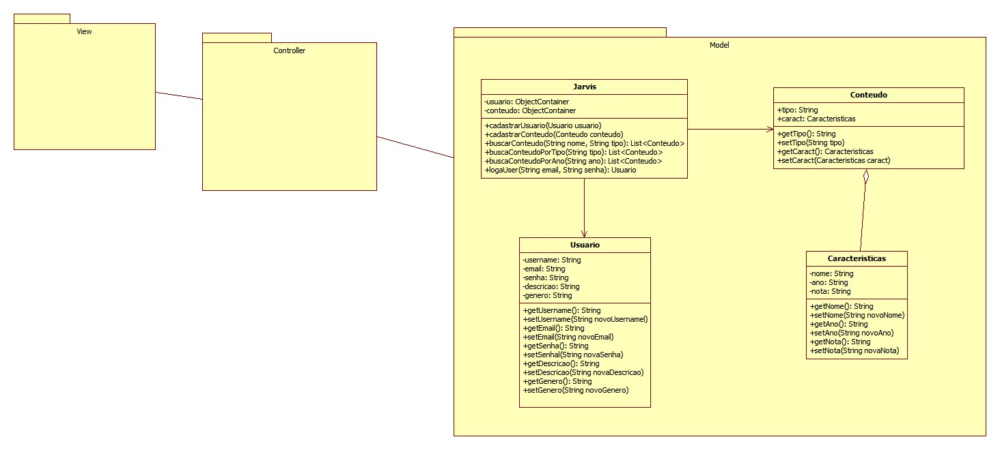

Jarvis
============

Aplicativo de cadastro e gerenciamento de conteudos
  nesse momento este app tem as seguintes funcionalidades:
  - Cadastro de conteudo
  - Cadastro de usuario
  - Login de usuario
  - Buscas de conteudos:
      - Busca convencional
      - Busca por tipo de conteudo
      - Busca por ano de lançamento do conteudo
  
------------------------------------

Segue abaixo o diagrama do projeto:

------------------------------------
